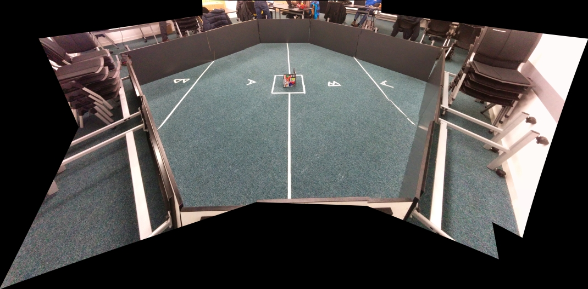
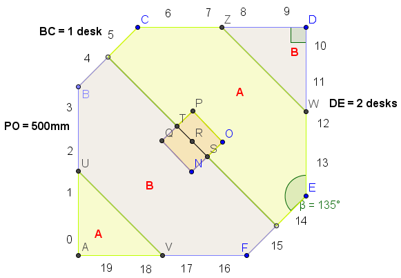

THE PENTAGON
============

A game of tables, tokens, and terror

\pagebreak

## ARENA

* Arena is a square of interesting dimensions, with the corners cut off. The best way to describe it is with a picture:

 
* Each diagonal around the outside is 1 table, and all other sides are 2 tables.
* UV and ZW extend from the edges of tables (i.e. the midpoints of BA, AF, ED, and DC)
* One table length is 1300mm, tables are 650mm tall
* 2 markers per table, equidistant, of a
scending numbers, clockwise from the corner of A's starting location (0 through 19 inclusive) [see diagram]
* Centre square is 500x500mm

\pagebreak

## THE GAME

* Consists of 2 teams
* Matches last 2minutes (robots must cease movement after two minutes or risk disqualification)
* Teams start in their designated Starting Corners, aiming to push cubes to their Goal Zone on the other side. A robot can start anywhere in its designated Starting Corner
* Points at end =  2 * (number of tokens in own Goal Zone) + [position points]
  - [position points] = [1 if ending in contact with the opponents Goal Zone but not your own or the centre square | 2 if in contact with your own Goal Zone but not he cetnre square | 3 if in contact with the centre square]
* The Team with the most points at the end wins
* The judge's decision is final

## TOKENS AND MARKERS

* Wall markers are 200mm in dimension
* Robots are markers 28 (A) and 29 (B)
* Tokens are cubes of side length 200mm with 6 markers, one on each face; the orientation of the cube has no bearing on its worth
* Tokens are not deliberately weighted (cardboard or similar)
* Marker on the Hill Token is 32
* Marker on Token in Goal Zone B is 33 (this Token can be positioned at will in Goal Zone B by Team A at the start of a match)
* Marker on Token in Goal Zone A is 34 (this Token can be positioned at will in Goal Zone A by Team B at the start of a match)
* Robots must have a space for four 100x100mm markers, such that one can be seen from any position outside of the robot on the horizontal plane of the robot, at least 500mm away from any point on the robot (The judge's decision is final)

